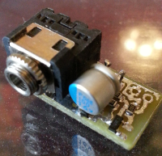

# Electret microphone preamplifier

This is a Kicad EDA project of electret microphone preamplifier for improving
low-end electret microphone sound on a PC sound card.

Original schematic of preamplifier was found in this [article](https://www.ixbt.com/live/nikolay-suhov/komplementarnyy-si-ge-srpp-v-predusilitele-dlya-elektretnika-ili-master-klass-po-mikrokapu-11-v-praktike-audiofila_2.html)
and slightly modified. It uses general purpose PNP transistor instead of germanium
transistor. Also, PCB has footprint for small TRS connector.

This preamplifier has it's pros and cons:

**Pros:**

1. High gain
2. No need for external power supply. It uses only PC/laptop mic in.
3. Small number of accessible parts
4. Very small size, if built with SMD components

**Cons:**

1. Needs shielding. Without shielding there is too much noise.

# Implementation

My implementation uses BC847C/BC857C transistors and headset unidirectional
electret microphone, which requires without preamplifier +20 dB from sound
card and is unusable with this amplification due to high noise level.

Modified version of microphone looks like this:

 

Both preamplifier case and microphone boom are metallic and
internally connected to GND to act as a shield.

Preamplifier was successfully tested with a laptop sound card
with following electrical specs:

V = 1.8 V; I = 0.36 mA; R = 5 kOhm

# Modifications

Preamplifier schematic is simple and allows modifications. It's
possible to use other general purpose low-noise transistors,
suitable for audio amplification.
Following SOT23 transistors may be used:

  - BC846/BC856, BC847/BC857, BC848/BC858, BC849/BC859, BC850/BC860

BC849/BC859 and BC850/BC860 pairs should give best results.

KiCAD EDA project files are made to be fully autonomous.
If you want to keep files this way and modify them,
add your files in `device/lib` and link them to project
in a similar way to existing library elements.

# License

This project is licensed under [The Unlicense](LICENSE).
It contains library files from KiCAD EDA library in `device/lib`.
These files are licensed under [KiCAD EDA Libraries License](https://kicad-pcb.org/libraries/license/)
